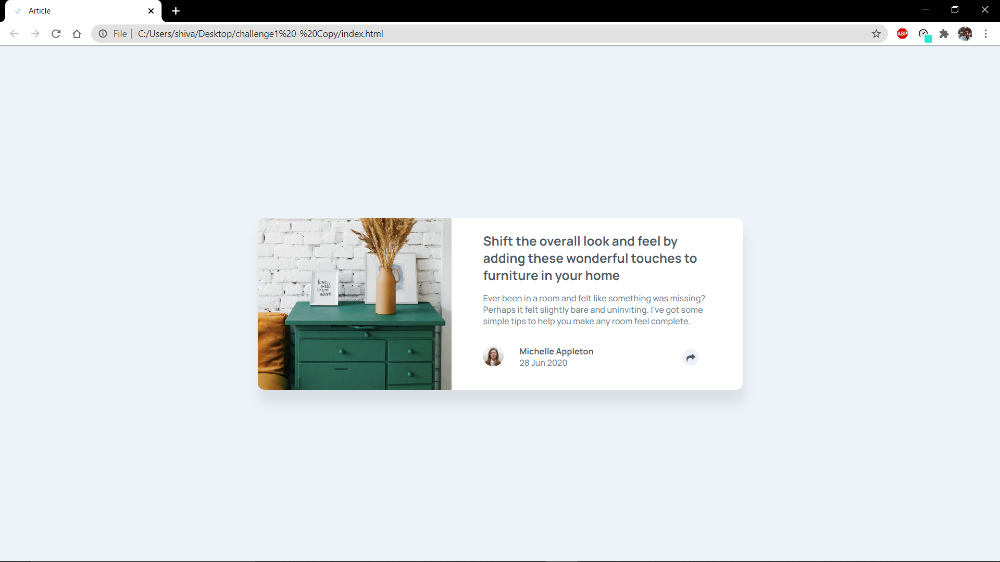
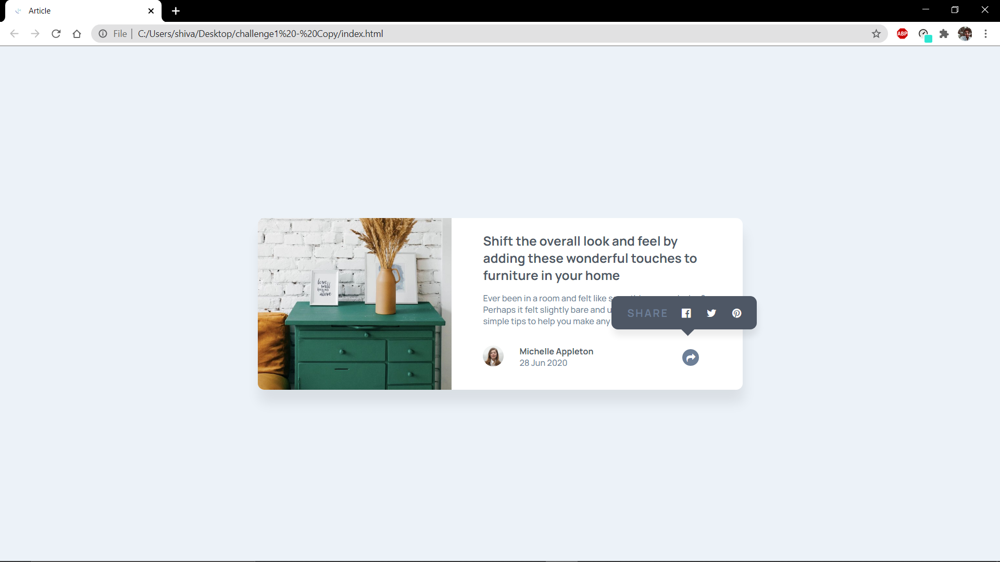
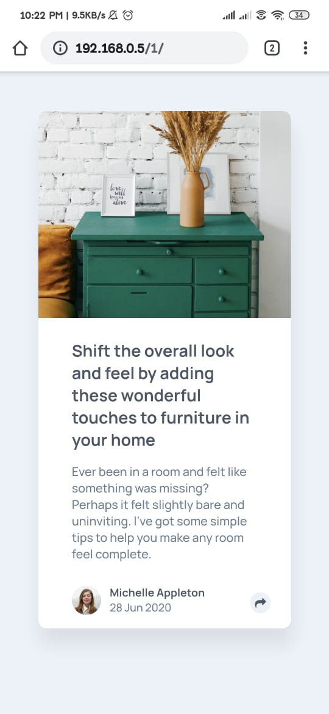
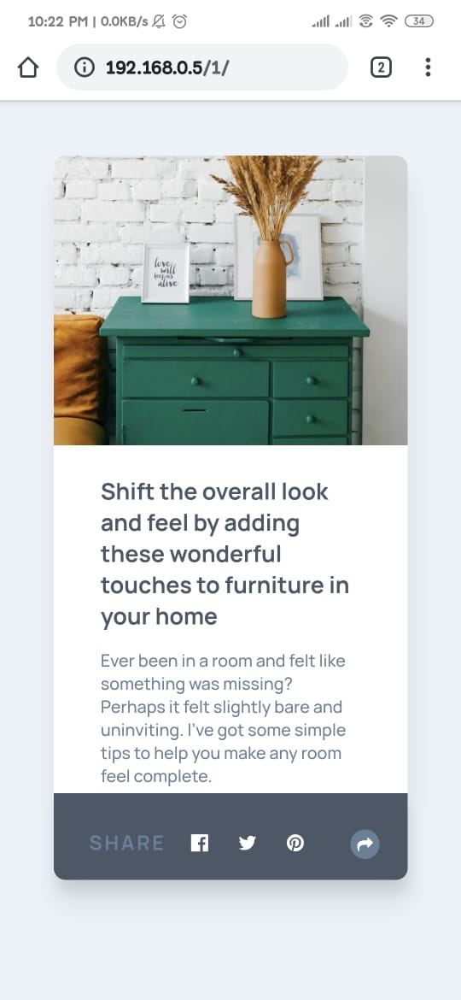

# CHALLENGE 1 - Article

## Screenshots of Challenge 1 attempted by me

 

 

 

 

## Welcome! 👋

**To do this challenge, you need a basic understanding of HTML, CSS and a tiny bit of JavaScript.**

## The challenge

Your challenge is to build out this article preview component and get it looking as close to the design as possible.

You can use any tools you like to help you complete the challenge. So if you've got something you'd like to practice, feel free to give it a go.

The only JavaScript you'll need for this challenge is to initiate the share options when someone clicks the share icon.

Your users should be able to: 

- View the optimal layout for the component depending on their device's screen size
- See the social media share links when they click the share icon

## Where to find everything

Your task is to build out the project to the designs inside the `/design` folder. You will find both a mobile and a desktop version of the design to work to. 

The designs are in JPG static format. This will mean that you'll need to use your best judgment for styles such as `font-size`, `padding` and `margin`. This should help train your eye to perceive differences in spacings and sizes.

If you would like the Sketch file in order to inspect the design in more detail it is available to buy from the challenge page on the platform.

You will find all the required assets in the `/images` folder. The assets are already optimized.

There is also a `style-guide.md` file, which contains the information you'll need, such as color palette and fonts.

## Building your project

Feel free to use any workflow that you feel comfortable with. Below is a suggested process, but do not feel like you need to follow these steps:

1. Initialize your project by forking the above challenge. 
2. Configure your repository to publish your code to a URL. This will also be useful if you need some help during a challenge as you can share the URL for your project with your repo URL.
3. Look through the designs to start planning out how you'll tackle the project. This step is crucial to help you think ahead for CSS classes that you could create to make reusable styles.
4. Before adding any styles, structure your content with HTML. Writing your HTML first can help focus your attention on creating well-structured content.
5. Write out the base styles for your project, including general content styles, such as `font-family` and `font-size`.
6. Start adding styles to the top of the page and work down. Only move on to the next section once you're happy you've completed the area you're working on.

